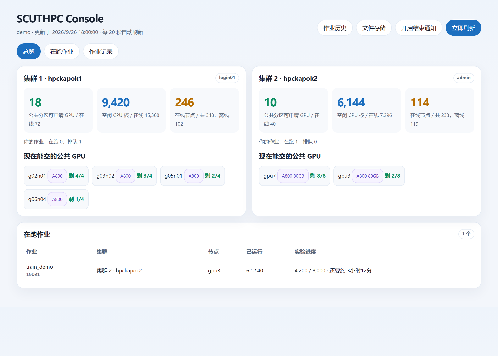
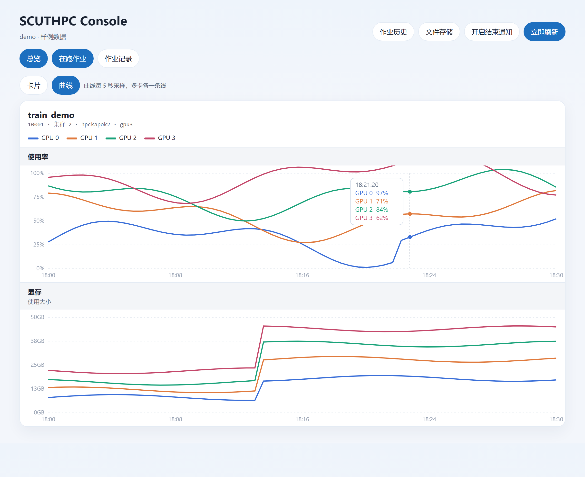
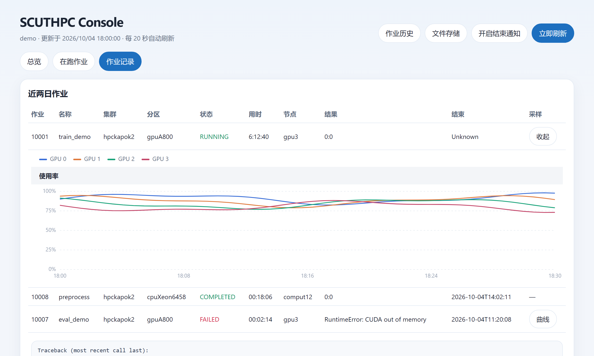

# SCUTHPC Console

本项目SCUTHPC Console 是华南理工大学科学计算平台的非官方本地状态控制台。它在你的计算机上通过 SSH 读取 [hpckapok1](https://hpckapok1.scut.edu.cn) 与 [hpckapok2](https://hpckapok2.scut.edu.cn) 的 Slurm 信息，在浏览器中呈现分区资源、在跑作业的显卡状态，以及近两日作业结果。方便实时跟踪和查阅实验进度。

服务只绑定本机。集群凭据留在 `~/.ssh`，不进入本仓库。

## 界面

以下为样例数据。







四个分页约每 20 秒刷新一次。

- **总览**按单机作业显示资源可放置的卡数，并按「N 卡 × 几台」列出。计算同时扣除 GPU、CPU 和按默认 24 GiB/卡估算的调度内存。集群 1 的 A800 按 1 卡 9 核，集群 2 按 1 卡 8 核；空卡还在但 CPU/内存不够的节点单独标出。名称以 `emic`、`gznet`、`ex`、`telecom` 开头的分区不计入。
- 总览另外运行一次按集群配核的 `srun --test-only` 调度探针，显示最近一次探测的预计启动时间、更新时间和可信度；“资源可放置”不等于“立即启动”。远期或无限时限作业造成的日期会显示为“无法可靠估计”。
- 右侧注意按钮解释空卡、调度探针和实际启动时间之间的差异；预计排队时间会随优先级、backfill、前序作业和节点状态变化。
- **集群资源**按分区给出在线节点、GPU 与 CPU 的空闲情况，并显示家目录相对 1 TB 免费配额的用量。
- **在跑作业**可以在卡片和曲线之间切换。曲线每 5 秒采样利用率与显存，多卡各一条线，鼠标悬停显示该时刻的数值。
- **作业记录**列出近两日作业。失败时附上日志末尾；6 小时内采过样的作业可以展开曲线。

右上角的作业历史和文件存储指向 [SCUT HPC 门户](https://hpckapok.scut.edu.cn)。文件链接中的用户名取自集群登录身份。允许浏览器通知后，页面保持打开时，作业完成或失败会收到一条系统通知。

## 相关链接

- [科学计算平台门户](https://hpckapok.scut.edu.cn)
- [用户手册](https://hpc.scut.edu.cn/docs/guide.html)
- [SCUTHPC Skill](https://github.com/IRAgentLab/SCUTHPCSkill/)：登录、分区、作业提交与排障。本控制台不重复这些说明。

## 运行

需要本机已能 SSH 登录两个集群。主机别名、密钥和账号的配法见 [SCUTHPC Skill](https://github.com/IRAgentLab/SCUTHPCSkill/)。

```bash
conda create -n hpc-monitor python=3.11 -y
conda activate hpc-monitor
pip install -r requirements.txt
python serve.py
```

本机打开 [http://127.0.0.1:8765](http://127.0.0.1:8765) 。Tailscale 在运行时，同一网络里的设备用 `tailscale ip -4` 的地址访问同一端口。

默认使用 SSH Host `scut-hpc1`（hpckapok1）和 `scut-hpc`（hpckapok2）。别名不同，或门户地址有变化时，复制 `config.example.json` 为 `config.json` 再改。

Windows cmd 进入其他盘符的目录时使用 `cd /d`。

## 采集范围

每次刷新对每个集群建立一次 SSH 会话，在登录节点读取节点、队列和近两日记账信息。正在运行的 GPU 作业会用 `srun --overlap` 采样一次 `nvidia-smi`。实验进度只来自标准输出末尾，程序若未打印步数，界面不会估计百分比。家目录按每人 1 TB 免费配额显示已用量。用量用家目录统计，约每 30 分钟更新一次，不是整个文件系统的占用。
